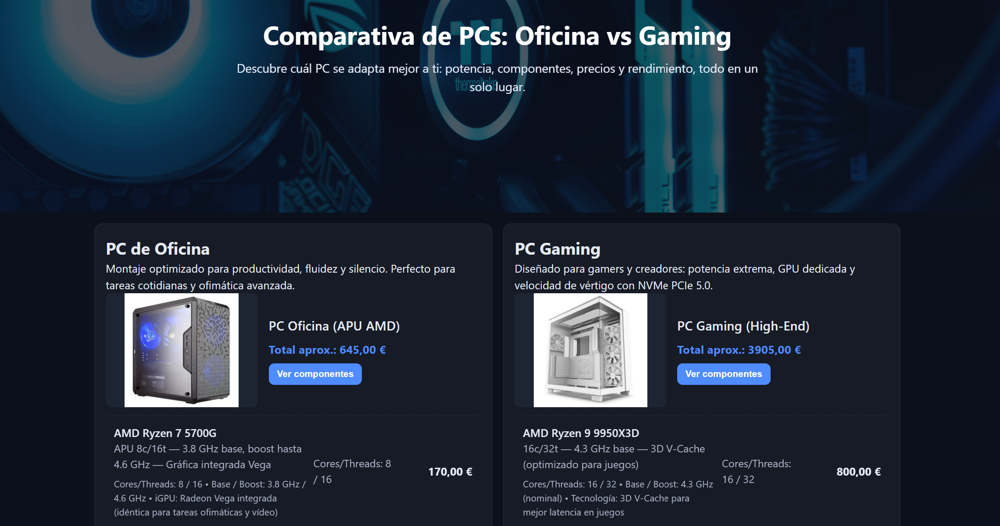

# Comparativa de PCs — Oficina vs Gaming

Una aplicación web interactiva que permite comparar en tiempo real dos configuraciones distintas de PC: un equipo equilibrado enfocado en productividad y ofimática, y un equipo de alta gama diseñado para gaming de rendimiento extremo.

🌐 **Página web en producción:** [https://proyecto-mmo-montaje.netlify.app/](https://proyecto-mmo-montaje.netlify.app/)

---

## 📸 Demostración y Vista Previa

### Vista Principal


### Animación / Demostración


---

## ✨ Características Principales

- **Fichas Detalladas de Componentes:** Desglose individual de especificaciones principales, formatos, velocidades, consumo y precios orientativos.
- **Tabla Comparativa Dinámica:** Comparación fila por fila entre la configuración de Oficina y la de Gaming.
- **Precios Actualizados:** Sumatorio aproximado automático para evaluar el presupuesto global de cada montaje.
- **Diseño Moderno y Responsivo:** Interfaz clara, fluida y adaptada a distintos dispositivos.

---

## 🛠️ Tecnologías Utilizadas

- **HTML5:** Estructuración semántica de la interfaz.
- **CSS3:** Estilos visuales, layout mediante Flexbox/Grid y adaptabilidad responsiva.
- **JavaScript (ES6+):** Lógica dinámica para la renderización e interacción con las especificaciones.
- **Netlify:** Despliegue y alojamiento continuo de la versión web.

---

## 📂 Estructura del Repositorio

```text
Proyecto_MMO_Montaje/
├── index.html          # Estructura principal de la aplicación web
├── styles.css          # Hojas de estilo y diseño
├── script.js           # Lógica interactiva y datos dinámicos
└── src/                # Recursos multimedia y documentación
    ├── Hero.jpg
    ├── Proyecto_MMO_Montaje.png
    ├── Proyecto_MMO_Montaje.gif
    ├── PC DE OFICINA.docx
    ├── Gaming/
    └── Oficina/
